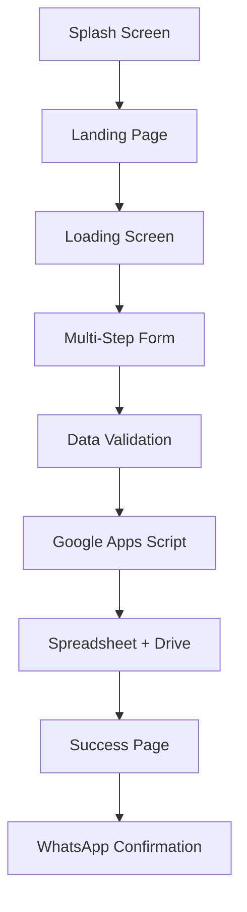

# 📋 Portal Karir SWAPRO - Panduan Lengkap


## 🌟 Deskripsi Aplikasi

Portal Karir SWAPRO adalah aplikasi web modern untuk pendaftaran karyawan yang dibangun dengan React, TypeScript, dan Tailwind CSS. Aplikasi ini menyediakan pengalaman pendaftaran yang interaktif dan user-friendly dengan integrasi langsung ke Google Spreadsheet dan Google Drive.

## 🚀 Fitur Utama

### ✨ **User Experience yang Menawan**
- **Splash Screen Animasi**: Pembukaan yang menarik dengan efek visual
- **Landing Page Informatif**: Informasi lengkap tentang SWAPRO dan posisi yang tersedia
- **Loading Screen**: Feedback visual saat memuat formulir
- **Progress Indicator**: Menunjukkan progres pengisian formulir
- **Responsive Design**: Optimal di semua perangkat (mobile, tablet, desktop)

### 📝 **Formulir Multi-Step yang Komprehensif**
1. **Posisi & Penempatan**: Pemilihan posisi dan lokasi kerja
2. **Data Pribadi**: Informasi personal lengkap
3. **Alamat**: Data alamat KTP dan domisili
4. **Pendidikan**: Riwayat pendidikan
5. **Pengalaman Kerja**: Pengalaman profesional (opsional)
6. **Dokumen & Persyaratan**: Upload CV dan checklist dokumen

### 🔒 **Keamanan & Validasi**
- **Anti-Duplikasi**: Pencegahan pendaftaran ganda berdasarkan NIK
- **Validasi Real-time**: Validasi input saat pengetikan
- **File Upload Security**: Validasi format dan ukuran file CV (PDF, max 5MB)
- **Data Sanitization**: Pembersihan data sebelum disimpan

### 🔗 **Integrasi Cloud**
- **Google Spreadsheet**: Penyimpanan data otomatis
- **Google Drive**: Upload dan penyimpanan CV
- **WhatsApp Integration**: Konfirmasi pendaftaran via WhatsApp

## 🏗️ Arsitektur Aplikasi

### **Frontend (React + TypeScript)**
```
src/
├── App.tsx                 # Komponen utama dengan state management
├── components/
│   ├── SplashScreen.tsx    # Layar pembuka dengan animasi
│   ├── LandingPage.tsx     # Halaman informasi perusahaan
│   ├── LoadingScreen.tsx   # Layar loading dengan progress
│   ├── ProgressSteps.tsx   # Indikator progres formulir
│   ├── FormInput.tsx       # Komponen input dengan validasi
│   └── BooleanInput.tsx    # Komponen radio button Ya/Tidak
└── index.css              # Styling dengan Tailwind CSS
```

### **Backend (Google Apps Script)**
- **doPost()**: Endpoint untuk menerima data formulir
- **doGet()**: Health check endpoint
- **testConnections()**: Testing koneksi ke Spreadsheet & Drive
- **checkDuplicateNIK()**: Validasi duplikasi NIK

## 🔧 Cara Kerja Aplikasi

### **1. User Journey**


### **2. Data Flow**
1. **Input**: User mengisi formulir 6 langkah
2. **Validation**: Validasi client-side dan server-side
3. **Processing**: Konversi file CV ke base64
4. **Transmission**: Kirim data via POST ke Google Apps Script
5. **Storage**: Simpan ke Spreadsheet, upload CV ke Drive
6. **Confirmation**: Tampilkan halaman sukses dengan link WhatsApp

### **3. State Management**
```typescript
interface FormData {
  // 40+ fields covering all aspects
  posisiDilamar: string;
  namaLengkap: string;
  // ... dan seterusnya
}

type AppState = 'splash' | 'landing' | 'loading' | 'form' | 'submitted';
```

## ⚙️ Setup & Konfigurasi

### **Prerequisites**
- Node.js 18+ dan npm
- Akun Google (untuk Spreadsheet & Drive)
- Google Apps Script access

### **1. Installation**
```bash
# Clone repository
git clone <repository-url>
cd portal-karir-swapro

# Install dependencies
npm install

# Start development server
npm run dev
```

### **2. Google Integration Setup**
Ikuti panduan lengkap di [`google-apps-script-setup.md`](google-apps-script-setup.md) untuk:
- Setup Google Apps Script
- Konfigurasi Spreadsheet
- Setup Google Drive folder
- Deploy web app
- Testing integrasi

### **3. Environment Configuration**
Update URL Google Apps Script di `src/App.tsx`:
```typescript
const GOOGLE_APPS_SCRIPT_URL = 'YOUR_DEPLOYED_SCRIPT_URL_HERE';
```

## 🎯 Fitur-Fitur Menarik

### **1. Dynamic Position-Placement Mapping**
```typescript
const positionPlacements = {
  'Sales Officer - CMO': [
    'ADIRA TEBET MOTOR',
    'ADIRA KELAPA GADING MOTOR',
    // ... lokasi lainnya
  ],
  'CUSTOMER SERVICE STAFF': [
    'ADIRA BACK OFFICE JAKARTA'
  ]
};
```
- Auto-select penempatan jika hanya 1 opsi
- Dynamic dropdown berdasarkan posisi

### **2. Smart Age Calculator**
```typescript
const calculateAge = (birthDate: string): string => {
  // Kalkulasi umur otomatis dari tanggal lahir
};
```

### **3. File Upload dengan Validasi**
- Format validation (hanya PDF)
- Size validation (max 5MB)
- Base64 conversion untuk upload
- Progress feedback

### **4. Anti-Duplicate System**
- Cek NIK sebelum menyimpan
- Pesan error yang informatif
- Mencegah data ganda

### **5. WhatsApp Integration**
```typescript
const generateWhatsAppMessage = (recruitmentNumber: number) => {
  return `Halo Recruitment ${recruitmentNumber}, saya telah mengisi formulir...`;
};
```
- 2 nomor recruitment berbeda
- Pre-filled message dengan data pendaftar

### **6. Responsive Progress Indicator**
- Mobile: Progress bar dengan persentase
- Desktop: Step-by-step visual indicator
- Smooth animations dan transitions

## 🛠️ Maintenance & Monitoring

### **1. Regular Checks**
```bash
# Health check Google Apps Script
curl https://your-script-url.com

# Test form submission
# Gunakan function testDoPost() di Google Apps Script
```

### **2. Data Monitoring**
- **Spreadsheet**: [Link ke Spreadsheet](https://docs.google.com/spreadsheets/d/1f1SPwqEnCocOVKKTq-6T5U7hB4zK0ICB1huyyv40toA/edit)
- **Drive Folder**: [Link ke Drive](https://drive.google.com/drive/folders/1CX03Rk8VImbIFVt1iR9BX17ie1T8IfC_)
- **Apps Script**: Monitor execution logs

### **3. Performance Optimization**
```typescript
// Lazy loading components
const LazyComponent = React.lazy(() => import('./Component'));

// Memoization untuk expensive calculations
const memoizedValue = useMemo(() => expensiveCalculation(data), [data]);
```

### **4. Error Handling**
- Client-side validation dengan feedback visual
- Server-side error handling dengan fallback
- CORS handling untuk cross-origin requests
- File upload error recovery

### **5. Security Maintenance**
- Regular dependency updates: `npm audit fix`
- Monitor Google Apps Script permissions
- Validate file uploads server-side
- Sanitize all user inputs

## 📊 Analytics & Reporting

### **Data yang Dikumpulkan**
- Timestamp pendaftaran
- Data demografis lengkap
- Preferensi posisi dan lokasi
- Riwayat pendidikan dan pengalaman
- Status dokumen dan persyaratan
- File CV dengan link Drive

### **Reporting Features**
- Auto-formatting di Spreadsheet
- Color-coding untuk status CV
- Sortable dan filterable data
- Export capabilities

## 🚨 Troubleshooting

### **Common Issues**

#### **1. Form Submission Failed**
```javascript
// Check di Google Apps Script logs
console.log('Error details:', error);

// Verify CORS settings
mode: 'no-cors'
```

#### **2. File Upload Issues**
- Cek format file (harus PDF)
- Cek ukuran file (max 5MB)
- Verify Google Drive permissions

#### **3. Duplicate NIK Error**
- Normal behavior untuk mencegah duplikasi
- Cek data existing di Spreadsheet
- Gunakan NIK berbeda untuk testing

#### **4. WhatsApp Link Not Working**
- Verify nomor telepon format
- Check URL encoding
- Test dengan nomor yang berbeda

## 🔄 Update & Deployment

### **Development Workflow**
```bash
# Development
npm run dev

# Build for production
npm run build

# Preview production build
npm run preview
```

### **Deployment Options**
- **Vercel**: Automatic deployment dari Git
- **Netlify**: Drag & drop atau Git integration
- **GitHub Pages**: Static hosting
- **Custom Server**: Upload build folder

### **Version Control**
```bash
# Commit changes
git add .
git commit -m "feat: add new feature"

# Tag releases
git tag -a v1.0.0 -m "Release version 1.0.0"
git push origin v1.0.0
```

## 📈 Future Enhancements

### **Planned Features**
- [ ] Email notifications
- [ ] PDF report generation
- [ ] Advanced analytics dashboard
- [ ] Multi-language support
- [ ] Dark mode theme
- [ ] Offline capability (PWA)
- [ ] Interview scheduling integration
- [ ] Automated status updates

### **Technical Improvements**
- [ ] Unit testing dengan Jest
- [ ] E2E testing dengan Cypress
- [ ] Performance monitoring
- [ ] SEO optimization
- [ ] Accessibility improvements (WCAG compliance)

## 🤝 Contributing

### **Development Guidelines**
1. Follow TypeScript best practices
2. Use Tailwind CSS untuk styling
3. Implement proper error handling
4. Add comments untuk complex logic
5. Test semua fitur sebelum commit

### **Code Style**
```typescript
// Use descriptive variable names
const isFormValid = validateStep(currentStep);

// Proper error handling
try {
  await submitForm();
} catch (error) {
  console.error('Submission failed:', error);
  showErrorMessage();
}
```

## 📞 Support & Contact

### **Technical Support**
- **Developer**: [Your Contact Info]
- **Documentation**: README.md dan google-apps-script-setup.md
- **Issues**: GitHub Issues atau internal ticketing system

### **Business Support**
- **HR Team**: WhatsApp links di aplikasi
- **Recruitment 1**: +62 857-1864-8488
- **Recruitment 2**: +62 857-1145-1184

---

## 📝 Changelog

### **Version 1.0.0** (Current)
- ✅ Multi-step form dengan 6 tahapan
- ✅ Google Spreadsheet integration
- ✅ Google Drive CV upload
- ✅ Anti-duplicate system
- ✅ WhatsApp confirmation
- ✅ Responsive design
- ✅ Loading states dan animations

### **Version 0.9.0** (Beta)
- ✅ Basic form functionality
- ✅ Google Apps Script setup
- ✅ File upload capability

---

**© 2024 SWAPRO - Portal Karir Digital**

*Aplikasi ini dikembangkan untuk mempermudah proses rekrutmen dan memberikan pengalaman terbaik bagi calon karyawan SWAPRO.*